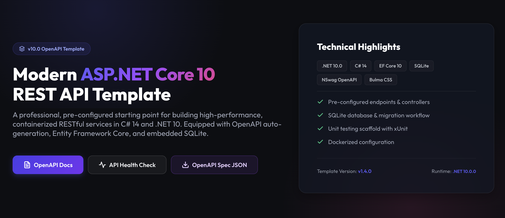

## ASP.NET Core v10 OpenAPI Template

[](https://www.codacy.com/gh/guildenstern70/AspNetCoreAPI/dashboard?utm_source=github.com&amp;utm_medium=referral&amp;utm_content=guildenstern70/AspNetCoreAPI&amp;utm_campaign=Badge_Grade)
[](https://opensource.org/licenses/MIT)

A basic Asp.NET Core v10 OpenAPI template. It uses an embedded SQLite database for data persistence.




## Setup

First, you need to create the database. Follow the instructions in the Entity Framework Core setup section below to install the necessary tools and packages. 

Then, run the database migrations to create the SQLite database.

    cd AspNetCoreAPI
    dotnet ef database update

This creates `AspNetCoreAPI/aspnetcoreapi.db`. If you need the test database too, copy it to the test project:

    cp aspnetcoreapi.db ../AspNetCoreAPI.Test/aspnetcoreapi.db


## Build and Run

To build the application run

    dotnet build

To run the application run

    cd AspNetCoreAPI
    dotnet run


### Run with Docker

You can build and run the application inside a Docker container using the provided `Dockerfile`.

1. **Build the Docker image** (from the repository root):

   ```bash
   docker build -t aspnetcoreapi:1.0 .
   ```

2. **Run the container**:

   ```bash
   docker run -d -p 3000:3000 --name aspnetcoreapi aspnetcoreapi:1.0
   ```

3. **Access the application**:
   - Web / Blazor UI: [http://localhost:3000](http://localhost:3000)
   - OpenAPI / Swagger UI: [http://localhost:3000/openapi](http://localhost:3000/openapi)
   - Health check endpoint: [http://localhost:3000/healthz](http://localhost:3000/healthz)

4. **Stop and remove the container**:

   ```bash
   docker stop aspnetcoreapi
   docker rm aspnetcoreapi
   ```

### Entity Framework Core setup

Read all about Entity Framework core here:
https://docs.microsoft.com/it-it/ef/core/get-started/overview/first-app?tabs=netcore-cli

    dotnet tool install --global dotnet-ef
    dotnet add package Microsoft.EntityFrameworkCore.Design

If you need to update the Entity Framework core:

    dotnet tool update --global dotnet-ef

### Unit Tests

    dotnet test

Please note that the tests rely on a different database which contains only test data.
The database for tests should be found in the AspNetCoreApi.Test project directory.
